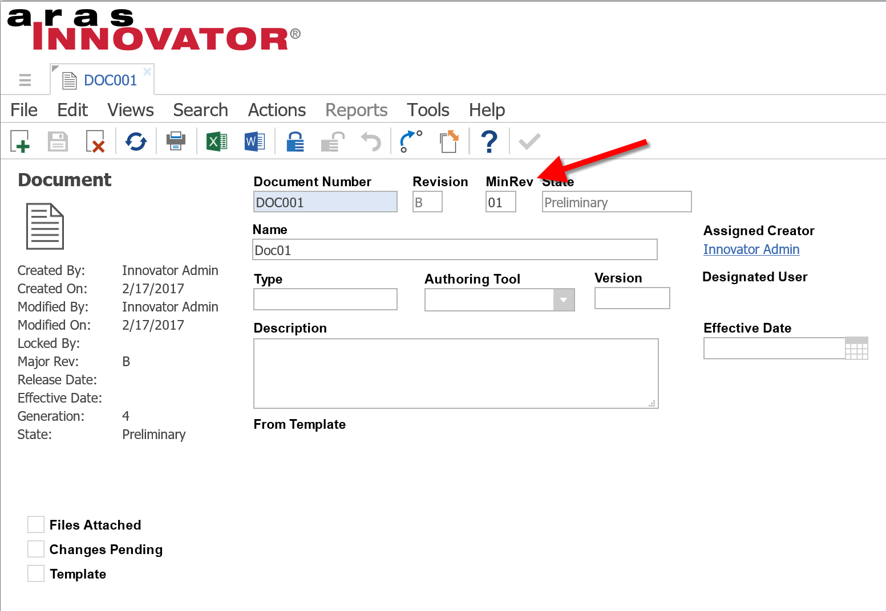

# Adding-Minor-Revision-Handling
Activates the minor revision property on documents

#### How it works
Whenever a change is made (lock, save, unlock) to a document, the minor revision will be incremented. Unlike the generation, when the document is major versioned, the minor revision is reset to 0.

## Project Details

**Built Using:** Aras 11.0 SP9
**Tested Using:** Aras 11.0 SP9
**Browsers Tested:** Internet Explorer 11, Firefox 38 ESR, Chrome

> Though built and tested using Aras 11.0 SP9, this project should function in older releases of Aras 11.0 and Aras 10.0.

## Installation

#### Important!
**Always back up your code tree and database before applying an import package or code tree patch!**

### Pre-requisites

1. Aras Innovator installed (version 11.0 SPx preferred)
2. Aras Package Import tool

### Install Steps

1. Backup your database and store the BAK file in a safe place.
2. Open up the Aras Package Import tool.
3. Enter your login credentials and click **Login**
  * _Note: You must login as root for the package import to succeed!_
4. Enter the package name in the TargetRelease field.
  * Optional: Enter a description in the Description field.
5. Enter the path to your local `..\Adding-Minor-Revision-Handling\Import\imports.mf` file in the Manifest File field.
6. Select **com.aras.innovator.solution.PLM** in the Available for Import field.
7. Select Type = **Merge** and Mode = **Thorough Mode**.
8. Click **Import** in the top left corner.
9. Close the Aras Package Import tool.

You are now ready to login to Aras and try out kanban like task management

## Usage

* Create a new document
* lock, modify, save and unlock multiple times to see the minor rev incrementing in the information
* Set yourself as the **Assigned Creator**
* create a nex revision (Actions->Create New Revision)
* The Minor Rev is back to 01

## Contributing

1. Fork it!
2. Create your feature branch: `git checkout -b my-new-feature`
3. Commit your changes: `git commit -am 'Add some feature'`
4. Push to the branch: `git push origin my-new-feature`
5. Submit a pull request

For more information on contributing to this project, another Aras Labs project, or any Aras Community project, shoot us an email at araslabs@aras.com.

## Credits

Original Aras community project written and documented by Rolf Laudenbach at Aras Corp.

Upgraded to v11 and published by Yoann Maingon at Aras Labs. @YoannArasLab

## License

Aras Labs projects are published to Github under the MIT license. See the [LICENSE file](./LICENSE.md) for license rights and limitations.